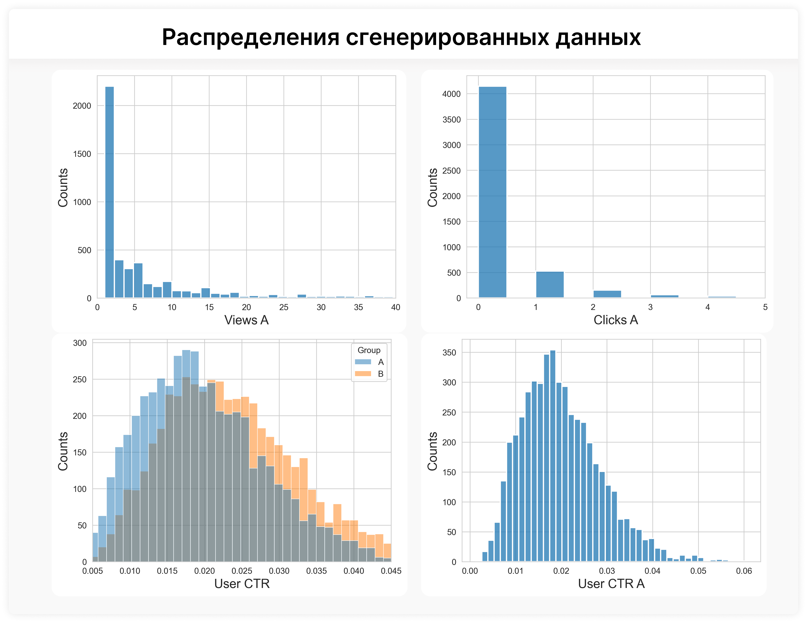
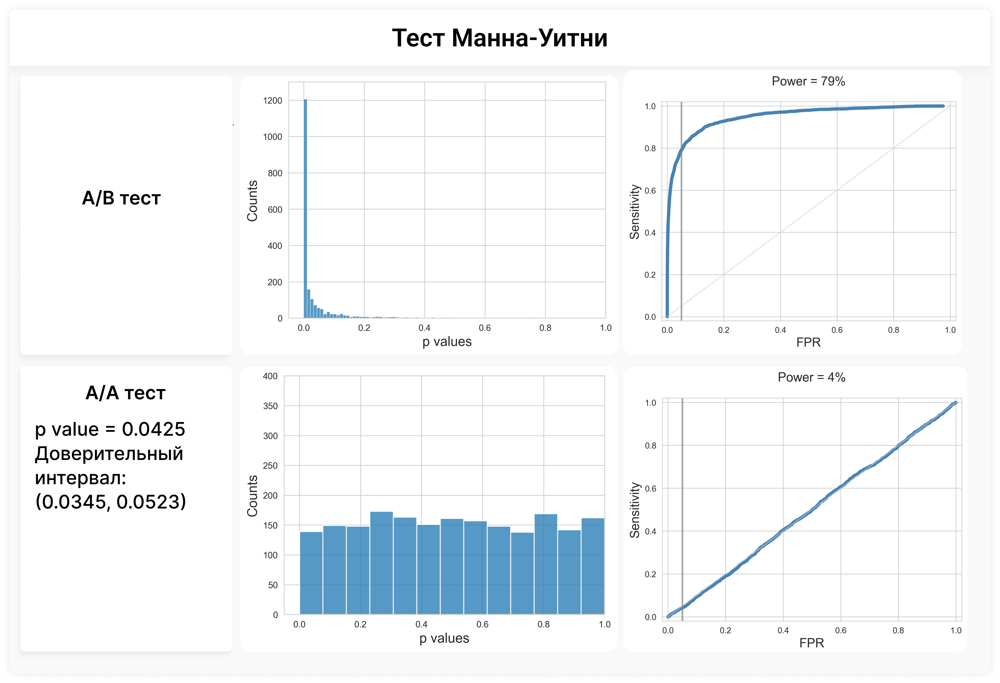
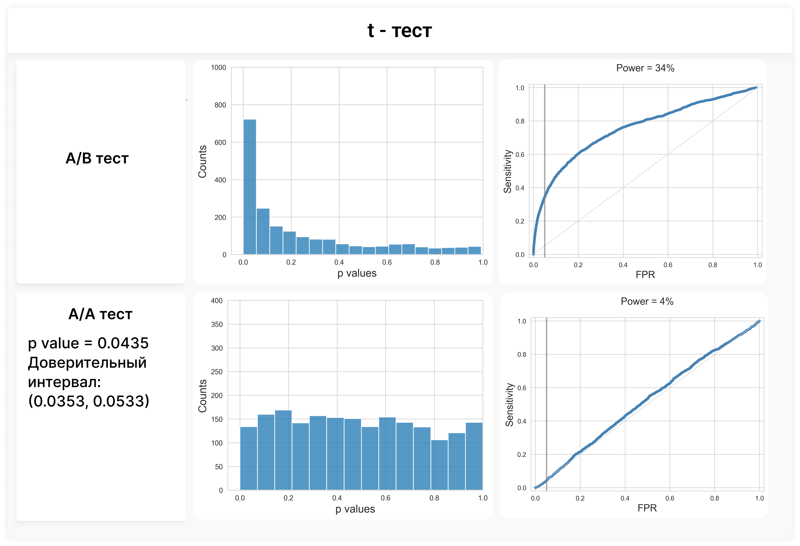
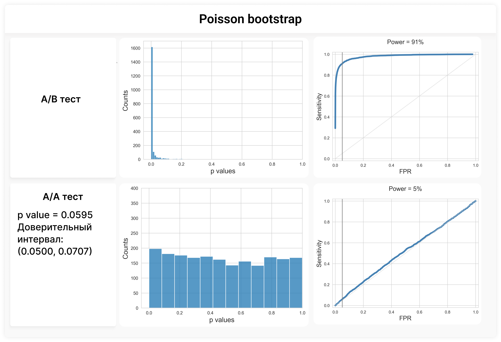
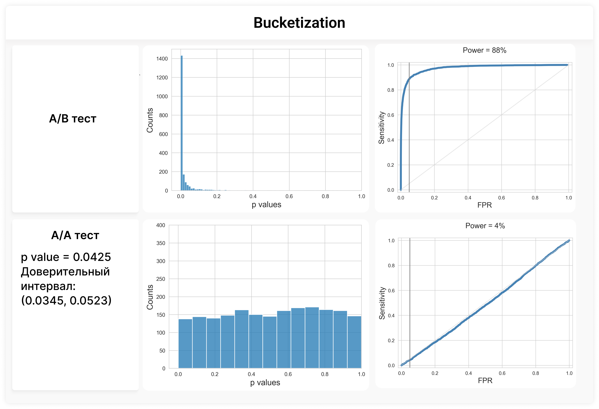

# A-B-tests-pet-project
В данной работе представлен пет проект по аналитике данных. Генерируются две выборки со смещенным средним и проводятся A/B и A/A тесты. Язык - Python

Задача:
Оценка модели прогнозирования CTR (кликабельности) для рекламы. Контролируемые эксперименты (A/B-тесты) — это самый надежный способ в данном случае.

Данные:
Данные генерируются с помощью функции generate_data. Предположим, что то, сколько раз пользователь увидел рекламу (views) распределено логнормально (большинство пользователей увидело мало рекламы, но некоторые - много). Пусть CTR пользователя (user CTR) описывается бета распределением (хорошо подходит, потому что область определения - [0, 1]). Тогда количество переходов на рекламный сайт (clicks) распределено биномиально, где число испытаний - это views, а вероятность успеха p - это user CTR.

<details>
<summary>Генерация данных
         
```python
def generate_data(n_users, success_rate, beta, uplift=0):
  mean = success_rate * (1 + uplift)
  alpha = (mean * beta) / (1 - mean)
 
  user_ctrs = np.random.beta(alpha, beta, size=n_users)
  views = np.random.lognormal(mean=1, sigma=2.0, size=n_users).astype(int) + 1
  clicks = np.random.binomial(n=views, p=user_ctrs)
 
  return views, clicks, user_ctrs
```
</details>

1. Задаем N (количество пользователей) для контрольной и тестовой групп. В данном случай N = 5000.
2. Генерируем количество увиденной рекламы одним пользователем (views) для тестовой и контрольной групп, используя одно и то же распределение
3. Генерируем user CTR для контрольной группы, где среднее равно success_rate, а для тестовой группы - success_rate * (1 + uplift). Пусть uplift = 0.2.
4. Генерируем clicks для обеих групп.

Проделав эти шаги один раз, мы получаем один A/B тест. Проделав это NN раз мы получим NN A/B тестов (метод Монте-Карло). Положим NN равным 2000.

A/B и A/A тесты:
В основном нулевая гипотеза звучит так: H_0 - средние контрольной и тестовой групп равны, а H_1 - средние не равны. Уровень значимости примем равным 0.05.
Для каждого A/B-теста мы проведём ряд статистических тестов и сравним их эффективность, построив ROC-кривую. Также расчитаем мощность каждого теста
Используемые тесты:
1. тест Манна-Уитни
2. t-тест
3. Пуассоновский бутстрэп
4. Бакетизация
Для каждого статистического теста мы должны иметь возможность проверить, контролирует ли p-значение FPR для наших данных. Чтобы это сделать, нам нужно сгенерировать A/A-тесты. Используем те же шаги генерации данных, но с uplift = 0. Значит распределения тестовой и контрольной групп будут одинаковы, следовательно, нулевая гипотеза (H₀) здесь будет истинна. p-value корректно контролирует FPR тогда и только тогда, когда для A/A-тестов p-значение распределено равномерно на отрезке [0, 1], а ROC-кривая имеет диагональный вид. Также для для оценки консервативности и антиконсервативности теста будем рассчитывать доверительный интервал Уилсона.

Тесты и результаты:
1. Тест Манна Уитни
   Используем функцию stats.mannwhitneyu, которая будет сравнивать медианы количеств нажатий на рекламу для групп A и B (clicks).
   
   <details>
   <summary>A/B тест. Манн-Уитни
      
         ```python
          #A/B тест (тест Манна-Уитни)
      
          NN = 2000
          pvalues = []
          cnt = 0
          #Monte-Carlo
          for _ in tqdm(range(NN)):
              views_a, clicks_a, user_ctrs_a = generate_data(N, success_rate, beta)
              views_b, clicks_b, user_ctrs_b = generate_data(N, success_rate, beta, uplift=uplift)
              reg = stats.mannwhitneyu(clicks_a, clicks_b)
              cnt += (reg.pvalue < alpha)
              pvalues.append(reg.pvalue)
      
          sns.histplot(x = pvalues)
          plt.xlabel('p values', fontsize = 15)
          plt.xlim(-0.05, 1)
          plt.ylim(0, 1300)
          plt.ylabel('Counts', fontsize = 15)
          plt.savefig('pvalues_mannwhitneyu.png', dpi=300, bbox_inches='tight') 
          plt.show()
      
          df_plot_ROC = pd.DataFrame({
              'FPR': np.sort(pvalues),
              'Sensitivity': [i / NN for i in range(NN)]
          })
          sns.lineplot(data=df_plot_ROC, x='FPR', y='Sensitivity', linewidth=4, color='steelblue')
          plt.plot([0, 1], [0, 1], color='lightgrey', linestyle='-', alpha=0.5)
          plt.axvline(x=alpha, color='grey', linestyle='-', linewidth=2, alpha=0.7)
          plt.xlim(-0.02, 1.02)
          plt.ylim(-0.02, 1.02)
          plt.xlabel('FPR', fontsize=15)
          plt.ylabel('Sensitivity', fontsize=15)
          plt.title(f'Power = {int(np.mean(np.array(pvalues) < alpha) * 100)}%', fontsize=15, pad=20)
          plt.savefig('ROC_mannwhitneyu.png', dpi=300, bbox_inches='tight')  
          plt.show()
         ```
   </details>
   <details>
   <summary>A/A тест. Манн-Уитни
      
         ```python
          #A/A тест (тест Манна-Уитни)
      
          NN = 2000
          pvalues = []
          cnt = 0
          #Monte-Carlo
          for _ in tqdm(range(NN)):
              views_a, clicks_a, user_ctrs_a = generate_data(N, success_rate, beta)
              views_b, clicks_b, user_ctrs_b = generate_data(N, success_rate, beta)
              reg = stats.mannwhitneyu(clicks_a, clicks_b)
              cnt += (reg.pvalue < alpha)
              pvalues.append(reg.pvalue)
          print(np.mean(np.array(pvalues) < alpha))
          print(proportion.proportion_confint(count = cnt, nobs = NN, alpha=0.05, method='wilson'))
          
          sns.histplot(x = pvalues)
          plt.xlabel('p values', fontsize = 15)
          plt.xlim(-0.05, 1)
          plt.ylim(0, 400)
          plt.ylabel('Counts', fontsize = 15)
          plt.savefig('pvalues_mannwhitneyu_AA.png', dpi=300, bbox_inches='tight') 
          plt.show()
          
          df_plot_ROC = pd.DataFrame({
                  'FPR': np.sort(pvalues),
                  'Sensitivity': [i / NN for i in range(NN)]
              })
          sns.lineplot(data=df_plot_ROC, x='FPR', y='Sensitivity', linewidth=4, color='steelblue')
          plt.plot([0, 1], [0, 1], color='lightgrey', linestyle='-', alpha=0.5)
          plt.axvline(x=alpha, color='grey', linestyle='-', linewidth=2, alpha=0.7)
          plt.xlim(-0.02, 1.02)
          plt.ylim(-0.02, 1.02)
          plt.xlabel('FPR', fontsize=15)
          plt.ylabel('Sensitivity', fontsize=15)
          plt.title(f'Power = {int(np.mean(np.array(pvalues) < alpha) * 100)}%', fontsize=15, pad=20)
          plt.savefig('ROC_mannwhitneyu_AA.png', dpi=300, bbox_inches='tight')  
          plt.show()
         ```
   </details>
2. t - тест
   Используем функцию stats.ttest_ind, которая будет сравнивать медианы количеств нажатий на рекламу для групп A и B (clicks).
   
   <details>
   <summary>A/B тест. t - тест
      
         ```python
         #A/B тест (t тест)

         NN = 2000
         pvalues = []
         
         #Monte-Carlo
         for _ in tqdm(range(NN)):
             views_a, clicks_a, user_ctrs_a = generate_data(N, success_rate, beta)
             views_b, clicks_b, user_ctrs_b = generate_data(N, success_rate, beta, uplift=uplift)
             reg = stats.ttest_ind(clicks_a, clicks_b)
             pvalues.append(reg.pvalue)
         
         sns.histplot(x = pvalues)
         plt.xlabel('p values', fontsize = 15)
         plt.xlim(-0.05, 1)
         plt.ylim(0, 1000)
         plt.ylabel('Counts', fontsize = 15)
         plt.savefig('pvalues_t.png', dpi=300, bbox_inches='tight')  
         plt.show()
         
         df_plot_ROC = pd.DataFrame({
                 'FPR': np.sort(pvalues),
                 'Sensitivity': [i / NN for i in range(NN)]
             })
         sns.lineplot(data=df_plot_ROC, x='FPR', y='Sensitivity', linewidth=4, color='steelblue')
         plt.plot([0, 1], [0, 1], color='lightgrey', linestyle='-', alpha=0.5)
         plt.axvline(x=alpha, color='grey', linestyle='-', linewidth=2, alpha=0.7)
         plt.xlim(-0.02, 1.02)
         plt.ylim(-0.02, 1.02)
         plt.xlabel('FPR', fontsize=15)
         plt.ylabel('Sensitivity', fontsize=15)
         plt.title(f'Power = {int(np.mean(np.array(pvalues) < alpha) * 100)}%', fontsize=15, pad=20)
         plt.savefig('ROC_t.png', dpi=300, bbox_inches='tight')  
         plt.show()
         ```
   </details>
   <details>
   <summary>A/A тест. t - тест
      
         ```python
         #A/A тест (t тест)

         NN = 2000
         pvalues = []
         cnt = 0
         #Monte-Carlo
         for _ in tqdm(range(NN)):
             views_a, clicks_a, user_ctrs_a = generate_data(N, success_rate, beta)
             views_b, clicks_b, user_ctrs_b = generate_data(N, success_rate, beta)
             reg = stats.ttest_ind(clicks_a, clicks_b)
             cnt += (reg.pvalue < alpha)
             pvalues.append(reg.pvalue)
         print(np.mean(np.array(pvalues) < alpha))
         print(proportion.proportion_confint(count = cnt, nobs = NN, alpha=0.05, method='wilson'))
         
         sns.histplot(x = pvalues)
         plt.xlabel('p values', fontsize = 15)
         plt.xlim(-0.05, 1)
         plt.ylim(0, 400)
         plt.ylabel('Counts', fontsize = 15)
         plt.savefig('pvalues_t_AA.png', dpi=300, bbox_inches='tight')  
         plt.show()
         
         df_plot_ROC = pd.DataFrame({
                 'FPR': np.sort(pvalues),
                 'Sensitivity': [i / NN for i in range(NN)]
             })
         sns.lineplot(data=df_plot_ROC, x='FPR', y='Sensitivity', linewidth=4, color='steelblue')
         plt.plot([0, 1], [0, 1], color='lightgrey', linestyle='-', alpha=0.5)
         plt.axvline(x=alpha, color='grey', linestyle='-', linewidth=2, alpha=0.7)
         plt.xlim(-0.02, 1.02)
         plt.ylim(-0.02, 1.02)
         plt.xlabel('FPR', fontsize=15)
         plt.ylabel('Sensitivity', fontsize=15)
         plt.title(f'Power = {int(np.mean(np.array(pvalues) < alpha) * 100)}%', fontsize=15, pad=20)
         plt.savefig('ROC_t_AA.png', dpi=300, bbox_inches='tight')   
         plt.show()
         ```
   </details>
3. Пуассоновский бутстрэп
   Бутстрэп считается трудоёмким с вычислительной точки зрения при работе с большими данными, но для расчёта глобального CTR мы можем применить пуассоновский бутстрап (Poisson bootstrap).
   Вместо повторной выборки пользователей мы генерируем для каждого пользователя число его появлений в выборке из распределения Пуассона. Затем мы взвешиваем просмотры и клики на это число.
   Это значительно ускоряют работу кода.
   Глобальный CTR можно выразить как взвешенное среднее индивидуальных CTR пользователей, где каждый пользовательский CTR взвешивается по количеству его просмотров.
   Вклад каждого пользователя в глобальный CTR пропорционален количеству его просмотров.
   Для реализации этого теста была написана соответствующая функция:
   <details>
   <summary>Poisson bootstrap
      
         ```python
         def bootstrap(ctrs_0, weights_0, ctrs_1, weights_1, n_bootstrap=2000):
             poisson_bootstraps = stats.poisson(1).rvs((n_bootstrap, ctrs_0.shape[1])).astype(np.int64)
         
             values_0 = np.matmul(ctrs_0 * weights_0, poisson_bootstraps.T)
             weights_0 = np.matmul(weights_0, poisson_bootstraps.T)
         
             values_1 = np.matmul(ctrs_1 * weights_1, poisson_bootstraps.T)
             weights_1 = np.matmul(weights_1, poisson_bootstraps.T)
         
             deltas = values_1 / weights_1 - values_0 / weights_0
         
             positions = np.sum(deltas < 0, axis=1)
         
             return 2 * np.minimum(positions, n_bootstrap - positions) / n_bootstrap
         ```
   </details>
   
   
   <details>
   <summary>A/B тест. Poisson bootstrap
      
         ```python
         #A/B тест (Poisson bootsrtap)

         NN = 2000
         all_ctrs_a = np.zeros((NN, N))
         all_weights_a = np.zeros((NN, N))
         all_ctrs_b = np.zeros((NN, N))
         all_weights_b = np.zeros((NN, N))
         #Монте-Карло
         for i in tqdm(range(NN)):
             views_a, clicks_a, _ = generate_data(N, success_rate, beta, uplift=0)
             views_b, clicks_b, _ = generate_data(N, success_rate, beta, uplift=uplift)
             all_ctrs_a[i, :] = clicks_a / views_a
             all_weights_a[i, :] = views_a
             all_ctrs_b[i, :] = clicks_b / views_b
             all_weights_b[i, :] = views_b
          
         pvalues = bootstrap(all_ctrs_a, all_weights_a, all_ctrs_b, all_weights_b, NN)
         
         sns.histplot(x = pvalues)
         plt.xlabel('p values', fontsize = 15)
         plt.xlim(-0.05, 1)
         plt.ylim(0, 1700)
         plt.ylabel('Counts', fontsize = 15)
         plt.savefig('pvalues_bootstrap.png', dpi=300, bbox_inches='tight')  
         plt.show()
         
         df_plot_ROC = pd.DataFrame({
                 'FPR': np.sort(pvalues),
                 'Sensitivity': [i / NN for i in range(NN)]
             })
         sns.lineplot(data=df_plot_ROC, x='FPR', y='Sensitivity', linewidth=4, color='steelblue')
         plt.plot([0, 1], [0, 1], color='lightgrey', linestyle='-', alpha=0.5)
         plt.axvline(x=alpha, color='grey', linestyle='-', linewidth=2, alpha=0.7)
         plt.xlim(-0.02, 1.02)
         plt.ylim(-0.02, 1.02)
         plt.xlabel('FPR', fontsize=15)
         plt.ylabel('Sensitivity', fontsize=15)
         plt.title(f'Power = {int(np.mean(np.array(pvalues) < alpha) * 100)}%', fontsize=15, pad=20)
         plt.savefig('ROC_bootstrap.png', dpi=300, bbox_inches='tight')  
         plt.show()
         ```
   </details>
   <details>
   <summary>A/A тест. Poisson bootstrap
      
         ```python
         #A/A тест (Poisson bootsrtap)

         NN = 2000
         all_ctrs_a = np.zeros((NN, N))
         all_weights_a = np.zeros((NN, N))
         all_ctrs_b = np.zeros((NN, N))
         all_weights_b = np.zeros((NN, N))
         #Монте-Карло
         for i in tqdm(range(NN)):
             views_a, clicks_a, _ = generate_data(N, success_rate, beta)
             views_b, clicks_b, _ = generate_data(N, success_rate, beta)
             all_ctrs_a[i, :] = clicks_a / views_a
             all_weights_a[i, :] = views_a
             all_ctrs_b[i, :] = clicks_b / views_b
             all_weights_b[i, :] = views_b
          
         pvalues = bootstrap(all_ctrs_a, all_weights_a, all_ctrs_b, all_weights_b, NN)
         print(np.mean(np.array(pvalues) < alpha))
         print(proportion.proportion_confint(count = np.count_nonzero(pvalues < 0.05), nobs = NN, alpha=0.05, method='wilson'))
         
         sns.histplot(x = pvalues)
         plt.xlabel('p values', fontsize = 15)
         plt.xlim(-0.05, 1)
         plt.ylim(0, 400)
         plt.ylabel('Counts', fontsize = 15)
         plt.savefig('pvalues_bootstrap_AA.png', dpi=300, bbox_inches='tight')  
         plt.show()
         
         df_plot_ROC = pd.DataFrame({
                 'FPR': np.sort(pvalues),
                 'Sensitivity': [i / NN for i in range(NN)]
             })
         sns.lineplot(data=df_plot_ROC, x='FPR', y='Sensitivity', linewidth=4, color='steelblue')
         plt.plot([0, 1], [0, 1], color='lightgrey', linestyle='-', alpha=0.5)
         plt.axvline(x=alpha, color='grey', linestyle='-', linewidth=2, alpha=0.7)
         plt.xlim(-0.02, 1.02)
         plt.ylim(-0.02, 1.02)
         plt.xlabel('FPR', fontsize=15)
         plt.ylabel('Sensitivity', fontsize=15)
         plt.title(f'Power = {int(np.mean(np.array(pvalues) < alpha) * 100)}%', fontsize=15, pad=20)
         plt.savefig('ROC_bootstrap_AA.png', dpi=300, bbox_inches='tight')    
         plt.show()
         ```
   </details>
   4. Бакетизация
   Простая и эффективная альтернатива бутстрэпу — бакетизация. Вместо того чтобы извлекать независимые выборки, мы разбиваем всех пользователей на небольшое количество корзин (bucket)
   рассчитываем глобальный CTR для каждой корзины. Каждую группу можно рассматривать как «мета-пользователя», а глобальный CTR корзины — как CTR этого мета-пользователя. Затем мы можем применить 
   стандартный t-тест к этим мета-пользователям, поскольку корзины независимы.
   Для реализации этого теста была написана соответствующая функция:
   <details>
   <summary>Bucketization
      
         ```python
         def bucketization(ctrs_0, weights_0, ctrs_1, weights_1, n_buckets=2000):
             n_experiments, n_users = ctrs_0.shape
         
             values_0 = np.zeros((n_experiments, n_buckets))
             values_1 = np.zeros((n_experiments, n_buckets))
         
             for b in np.arange(n_buckets):
                 ind = np.arange(b * n_users / n_buckets, b * n_users / n_buckets + n_users / n_buckets).astype(int)
                 values_0[:, b] = np.sum(ctrs_0[:, ind] * weights_0[:, ind], axis=1) / np.sum(weights_0[:, ind], axis=1)
                 values_1[:, b] = np.sum(ctrs_1[:, ind] * weights_1[:, ind], axis=1) / np.sum(weights_1[:, ind], axis=1)
         
             return stats.ttest_ind(values_0, values_1).pvalue
         ```
   </details>
   
   
   <details>
   <summary>A/B тест. Bucketization
      
         ```python
         #A/B тест (Bucketization)

         NN = 2000
         all_ctrs_a = np.zeros((NN, N))
         all_weights_a = np.zeros((NN, N))
         all_ctrs_b = np.zeros((NN, N))
         all_weights_b = np.zeros((NN, N))
         #Монте-Карло
         for i in tqdm(range(NN)):
             views_a, clicks_a, _ = generate_data(N, success_rate, beta, uplift=0)
             views_b, clicks_b, _ = generate_data(N, success_rate, beta, uplift=uplift)
             all_ctrs_a[i, :] = clicks_a / views_a
             all_weights_a[i, :] = views_a
             all_ctrs_b[i, :] = clicks_b / views_b
             all_weights_b[i, :] = views_b
         
         pvalues = bucketization(all_ctrs_a, all_weights_a, all_ctrs_b, all_weights_b)
         
         sns.histplot(x = pvalues)
         plt.xlabel('p values', fontsize = 15)
         plt.xlim(-0.05, 1)
         plt.ylim(0, 1500)
         plt.ylabel('Counts', fontsize = 15)
         plt.savefig('pvalues_bucketization.png', dpi=300, bbox_inches='tight')  
         plt.show()
         
         df_plot_ROC = pd.DataFrame({
                 'FPR': np.sort(pvalues),
                 'Sensitivity': [i / NN for i in range(NN)]
             })
         sns.lineplot(data=df_plot_ROC, x='FPR', y='Sensitivity', linewidth=4, color='steelblue')
         plt.plot([0, 1], [0, 1], color='lightgrey', linestyle='-', alpha=0.5)
         plt.axvline(x=alpha, color='grey', linestyle='-', linewidth=2, alpha=0.7)
         plt.xlim(-0.02, 1.02)
         plt.ylim(-0.02, 1.02)
         plt.xlabel('FPR', fontsize=15)
         plt.ylabel('Sensitivity', fontsize=15)
         plt.title(f'Power = {int(np.mean(np.array(pvalues) < alpha) * 100)}%', fontsize=15, pad=20)
         plt.savefig('ROC_bucketization.png', dpi=300, bbox_inches='tight')  
         plt.show()
         ```
   </details>
   <details>
   <summary>A/A тест. Bucketization
      
         ```python
         #A/A тест (Bucketization)

         NN = 2000
         all_ctrs_a = np.zeros((NN, N))
         all_weights_a = np.zeros((NN, N))
         all_ctrs_b = np.zeros((NN, N))
         all_weights_b = np.zeros((NN, N))
         #Монте-Карло
         for i in tqdm(range(NN)):
             views_a, clicks_a, _ = generate_data(N, success_rate, beta)
             views_b, clicks_b, _ = generate_data(N, success_rate, beta)
             all_ctrs_a[i, :] = clicks_a / views_a
             all_weights_a[i, :] = views_a
             all_ctrs_b[i, :] = clicks_b / views_b
             all_weights_b[i, :] = views_b
         
         pvalues = bucketization(all_ctrs_a, all_weights_a, all_ctrs_b, all_weights_b)
         print(np.mean(np.array(pvalues) < alpha))
         print(proportion.proportion_confint(count = np.count_nonzero(pvalues < 0.05), nobs = NN, alpha=0.05, method='wilson'))
         
         sns.histplot(x = pvalues)
         plt.xlabel('p values', fontsize = 15)
         plt.xlim(-0.05, 1)
         plt.ylim(0, 400)
         plt.ylabel('Counts', fontsize = 15)
         plt.savefig('pvalues_bucketization_AA.png', dpi=300, bbox_inches='tight')  
         plt.show()
         
         df_plot_ROC = pd.DataFrame({
                 'FPR': np.sort(pvalues),
                 'Sensitivity': [i / NN for i in range(NN)]
             })
         sns.lineplot(data=df_plot_ROC, x='FPR', y='Sensitivity', linewidth=4, color='steelblue')
         plt.plot([0, 1], [0, 1], color='lightgrey', linestyle='-', alpha=0.5)
         plt.axvline(x=alpha, color='grey', linestyle='-', linewidth=2, alpha=0.7)
         plt.xlim(-0.02, 1.02)
         plt.ylim(-0.02, 1.02)
         plt.xlabel('FPR', fontsize=15)
         plt.ylabel('Sensitivity', fontsize=15)
         plt.title(f'Power = {int(np.mean(np.array(pvalues) < alpha) * 100)}%', fontsize=15, pad=20)
         plt.savefig('ROC_bucketization_AA.png', dpi=300, bbox_inches='tight')  
         plt.show()
         ```
   </details>
